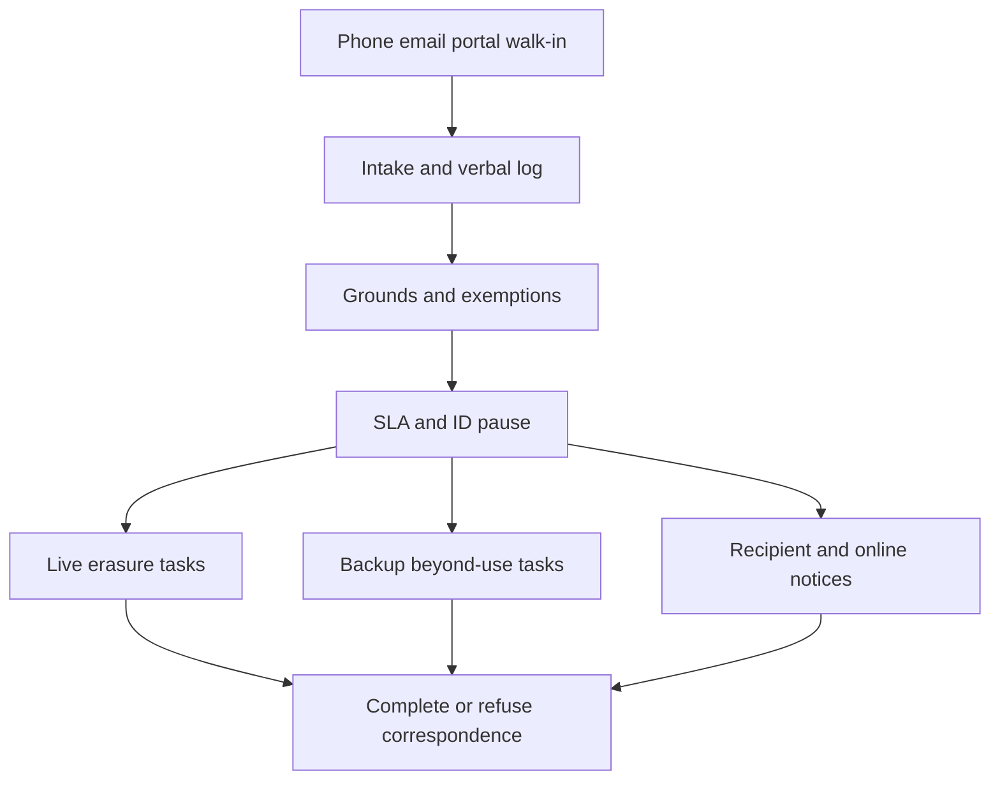

# Forgetcase

**Source:** `ai-in-decentralized+ai/Right to erasure _ ICO/`
**Domain:** `ai-decentralized`
**One-liner:** An Article 17 case desk that recognises verbal or written erasure requests, applies statutory grounds and exemptions, manages the one-month clock (with lawful extensions), and proves live-plus-backup “beyond use” handling — especially for children’s data.
**Wedge:** UK/EU mid-market controllers whose frontline staff already receive forget requests by phone and email but still track them in shared inboxes — starting with customer-support-heavy retailers and digital services collecting child data.
**Positioning:** Statutory casework for the right to be forgotten. The ICO guide stresses the right is not absolute, one-month response, recipient notice when data was disclosed or made public online, backup systems must be put beyond use, and children’s data carries particular weight. Forgetcase is the case-management product; it is not a multi-vendor erasure mesh (see Erasuremesh) and not a trust scoreboard (see Trustkeep).

## Market research synthesis

### Thesis from source

The ICO’s Right to Erasure guidance under GDPR Article 17 establishes that individuals may request erasure verbally or in writing, that organisations have one month to respond, and that the right applies only in defined circumstances: data no longer necessary; consent withdrawn; legitimate-interests objection without override; direct-marketing objection; unlawful processing; legal obligation to erase; or information-society services offered to a child. Checklists require recognising requests, recording verbal requests, knowing refusal bases, responding without undue delay, extending only when allowed, weighting children’s data, informing recipients, and having erasure methods.

Children receive enhanced emphasis: even when the data subject is no longer a child, consent given as a child for internet processing should attract particular weight because the child may not have understood the risks. Controllers must tell other organisations when data was disclosed or made public online (links, copies, replications), contacting each recipient unless impossible or disproportionate effort — and informing the individual of recipients if asked. Recipients include controllers, processors, and authorised persons.

Backups are a practical core: valid erasure requires steps for backup as well as live systems; organisations must be clear with individuals what happens, including delayed overwrite; the key is putting backup data “beyond use” so it is not used for any other purpose until replaced on schedule. Exemptions include freedom of expression, legal obligation, public-interest tasks, certain archiving/research/statistics, legal claims, and specified public-health / occupational-medicine special-category contexts. Manifestly unfounded or excessive requests may attract a reasonable fee or refusal with justification. Refusals require reasons, ICO complaint rights, and judicial remedy information within one month. Identity verification must be proportionate; the clock pauses until ID is received. Calendar-month timing quirks (shorter months, weekends) lead the ICO to note a practical 28-day operational target.

### Buyer & economic model

- **Primary buyer:** Data Protection Officer / Head of Customer Privacy Operations at a UK or EU controller.
- **Users:** privacy caseworkers, frontline support agents (intake), records managers (backups), children’s-services product owners, legal advisors on exemptions.
- **Budget owner / value metric:** privacy operations budget; value metric is on-time lawful outcomes (erase, refuse with grounds, or extend) with backup beyond-use evidence.
- **Competing status quo:** shared mailbox, spreadsheet SLA tracking, ad-hoc legal email for exemptions, backup teams unaware of open erasure cases.

### Domain constraints

- **Regulatory / trust / safety:** Article 17 grounds and exemptions; DPA 2018 additional exemptions; children’s privacy; ICO complaint exposure.
- **Data sensitivity:** case files contain identity-verification materials that must be minimised and time-boxed.
- **Change-management realities:** any employee may receive a verbal request — training and intake UX matter more than a perfect delete API.

## Business requirements

- BR-1: The system must accept and log verbal and written erasure requests without requiring the phrase “Article 17” or “right to erasure.”
- BR-2: Each case must evaluate applicable statutory grounds and record whether the right applies before technical delete is attempted.
- BR-3: Response SLA must default to one calendar month from day after receipt, with optional 28-day operational target, and lawful two-month extensions only when complexity or multiple requests justify — with notice inside the first month.
- BR-4: Children’s data cases (including adult subjects whose data was collected as children online) must be flagged for heightened review weight.
- BR-5: Recipient notification workflows must cover disclosed recipients and online public copies/links, with disproportionate-effort documentation.
- BR-6: Backup handling must capture beyond-use controls and scheduled overwrite expectations communicated to the individual.
- BR-7: Exemptions and manifestly unfounded/excessive determinations must produce refusal letters with reasons, ICO complaint rights, and judicial remedy notice within one month.
- BR-8: Identity verification requests must be proportionate and pause the compliance clock until received.
- BR-9: Fees are disallowed except for justified unfounded/excessive cases, with fee basis recorded.
- BR-10: Multi-vendor processor fan-out graphs are out of primary scope beyond a recipient list for notice obligations.
- BR-11: Case audit trails must support ICO investigation without retaining excess ID documents past necessity.
- BR-12: Frontline staff must have a guided intake so verbal requests are not lost.

## User stories

Canonical user stories live in sibling [USER_STORIES.md](USER_STORIES.md).

## System design

### Overview

Forgetcase is a case-management system for Article 17. Intake captures multi-channel requests; a rules-assisted assessment selects grounds, exemptions, child-weight flags, and ID needs; an SLA engine tracks the month clock and extensions; fulfilment tracks live erasure, backup beyond-use, and recipient notices; correspondence templates cover completion and refusal.

### Actors & boundaries

- **Actors:** data subjects, frontline agents, caseworkers, backup owners, DPO, ICO (external).
- **Trust boundary:** case desk holds minimal subject identifiers; source systems perform deletes; ICO receives exports only under investigation protocols.
- **Human-in-the-loop points:** exemption approval, unfounded/excessive determination, child-weight escalation, disproportionate-effort on recipient notice.

### Core capabilities

1. **Multi-channel intake and verbal logging**
2. **Grounds, exemptions, and child-weight assessment**
3. **SLA clock, extensions, and ID pause**
4. **Live erasure and backup beyond-use tasks**
5. **Recipient and online-copy notices**
6. **Refusal / completion correspondence**
7. **Case audit export**

### Conceptual data

- **Primary entities:** ErasureCase, IntakeEvent, GroundAssessment, ExemptionRecord, SlaClock, IdentityChallenge, LiveErasureTask, BackupBeyondUseTask, RecipientNotice, CorrespondenceItem.
- **Critical events:** request received, ID requested, grounds confirmed, exemption applied, extended, erased, beyond-use set, refused, closed.
- **Retention / audit needs:** case decisions retained for complaint windows; ID documents deleted when no longer necessary.

### Integrations (conceptual)

- **Systems of record:** CRM, identity store, backup catalogue, CMS/social for public copies, email/telephony.
- **Upstream signals:** support tickets, web forms, call recordings metadata.
- **Downstream actions:** delete jobs, backup hold/beyond-use flags, notice emails, ICO complaint response packs.

### High-level architecture

### Success metrics

- **Leading:** % verbal requests logged same day; % cases with backup beyond-use recorded; median days to first assessment.
- **Lagging:** on-time closure rate within calendar month; ICO complaint overturn rate; child-data escalation compliance.

## OpenAPI skeleton

Canonical HTTP surface lives in sibling [openapi.yaml](openapi.yaml). Summary:

- **Base path:** `/v1/...`
- **Auth:** API key / Bearer JWT.
- **Resource groups:** Cases, Assessments, SlaClocks, BackupTasks, Correspondence.
