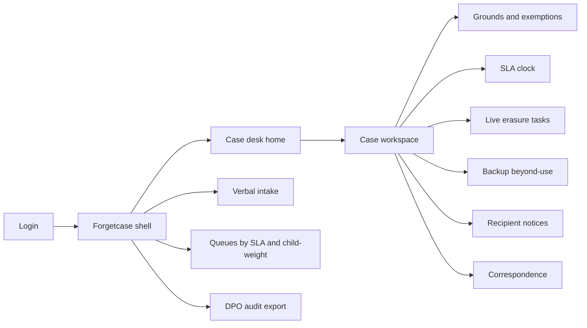
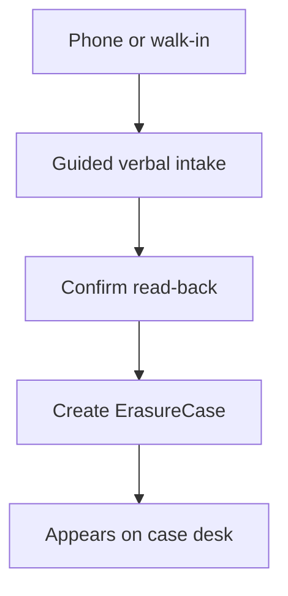
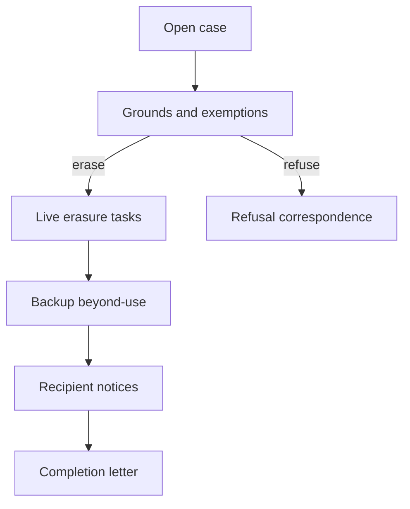

# Forgetcase — Web app

**Product:** [PRODUCT.md](./PRODUCT.md)
**Primary surface:** Article 17 case desk (privacy caseworker console)
**Secondary surfaces:** Frontline verbal intake (guided 2-minute log); subject-facing completion/refusal letter viewer (read-only); DPO audit export pack
**Design thesis:** Forgetcase is a statutory case desk, not a “privacy dashboard.” The metaphor is a courthouse docket plus a ticking calendar-month clock: every case shows whether Article 17 grounds apply, whether an exemption blocks erase, and whether live systems and backups are both beyond use. Visual language is cool parchment-on-ink (warm off-white paper field on deep charcoal dockets) with clock-amber for SLA risk and child-weight indigo for heightened review — never a marketing privacy purple. The Forgetcase wordmark sits like a court stamp on every case header so frontline and DPO share one authority surface.

## UX research synthesis

### Category peers (best-in-class)

- **OneTrust Privacy Rights Automation:** Intake → verify → fulfill → respond pipeline with SLA countdowns and template correspondence. Steal: stage-gated case rail and calendar-aware due dates; reject OneTrust’s sprawling preference-center chrome that buries Article 17 assessment.
- **DataGrail Request Manager:** Dense queue with identity challenge and system fan-out tasks. Steal: pause-the-clock when ID is outstanding; reject treating “all systems deleted” as done without a backup beyond-use step.
- **Transcend Admin / Privacy Center:** Clear subject correspondence and request-type specificity. Steal: plain-language request capture that does not require the subject to say “Article 17”; reject consumer-app illustration style for the operator desk.
- **Osano DSAR / TrustArc request modules:** Refusal and exemption documentation with regulator notices. Steal: refusal packs that always include complaint and remedy language; reject fee-first UX (fees are exceptional under BR-9).

### Patterns to adopt / reject

- **Adopt:** Verbal intake under two minutes with read-back; grounds-before-delete gate; calendar-month SLA with lawful extension notice inside month one; child-weight escalation banner; backup beyond-use as a first-class task equal to live erase; recipient/online-copy notice checklist with disproportionate-effort rationale; ID pause that freezes the clock visibly.
- **Reject:** “Delete all” one-click without assessment; generic DSAR mega-forms that mix access/portability with erasure; rainbow compliance score tiles; purple AI “auto-erase” panels; spreadsheet-style SLA without clock pause states; retaining ID scans on the case forever.

### Trust, density, and workflow constraints from PRODUCT.md

Caseworkers must decide erase vs refuse before technical delete (BR-2); the UI must make exemption and child-weight (BR-4) impossible to skip. Frontline staff may receive verbal requests without legal vocabulary (BR-1, BR-12), so intake must be guided and loss-proof. SLA is calendar-month with optional 28-day ops target and ID pause (BR-3, BR-8). Backup beyond-use and recipient notices are completion criteria, not footnotes (BR-5, BR-6). Refusal letters need mandatory ICO/judicial notices within one month (BR-7). Audit trails must support ICO export while minimising retained ID (BR-11). Multi-vendor erasure mesh is out of primary scope (BR-10) — recipient list for notices only.

## Information architecture

### Nav model

### Roles → default home

| Role | Default home | Why |
|------|--------------|-----|
| Privacy caseworker | Case desk — due this week | Grounds, fulfilment, letters (BR-2, BR-3) |
| Frontline support agent | Verbal intake | Log forget requests in &lt;2 minutes (BR-12) |
| Records / backup owner | Backup beyond-use queue | Beyond-use tasks, not live CRM deletes (BR-6) |
| Children’s product owner | Child-weight escalations | Heightened review (BR-4) |
| DPO / legal | Audit export + exemption approvals | Refusal packs and DPA 2018 bases (BR-7, BR-11) |

### Cross-links to OpenAPI resources

| Nav area | OpenAPI tags / resources |
|----------|---------------------------|
| Case desk / case workspace | Cases |
| Grounds, exemptions, child-weight | Assessments |
| Deadline, extension, ID pause | SlaClocks |
| Backup beyond-use | BackupTasks |
| Completion / refusal letters | Correspondence |

## Screen inventory

### Case desk home

- **Purpose:** Answer “which erasure cases breach (or will breach) the calendar-month clock, and which need child-weight review?”
- **Entry:** Post-login for caseworker/DPO roles.
- **Layout regions:** Brand + org switcher; SLA risk strip (overdue, due ≤7 days, ID-paused, extended); child-weight escalation lane; filterable case table (status, ground outcome, backup status, channel); alerts for extension notice due inside month one.
- **Primary actions:** Open case; start verbal intake; export on-time closure report.
- **Empty / loading / error:** Empty = “no open erasure cases — intake still available”; loading = skeleton strip + table; error = retry with request id.
- **BR / story ties:** BR-3, BR-4; caseworker SLA stories.

### Verbal intake

- **Purpose:** Capture a forget request from phone/walk-in without requiring Article 17 language, with confirmation read-back.
- **Entry:** Frontline default; case desk CTA; deep link from support ticket.
- **Layout regions:** Guided prompts (who, what data concern, channel, child-related hint); free-text request summary; read-back confirmation panel; optional attach email/ticket id; create-case footer.
- **Primary actions:** Confirm read-back and create case; save draft if call drops; hand off to caseworker queue.
- **Empty / loading / error:** Validation if identity contact missing; error = case not created with retry.
- **BR / story ties:** BR-1, BR-12; frontline agent stories.
- **Mobile notes:** Single-column prompts; large confirm control for headset use.

### Case workspace

- **Purpose:** One case as the operating record: intake → assessment → fulfilment → correspondence.
- **Entry:** Desk table; intake success; SLA alert.
- **Layout regions:** Case header (Forgetcase stamp, subject minimised id, child-weight badge, SLA clock chip); stage rail; left summary (channel, received date, ID state); centre work pane; right audit trail.
- **Primary actions:** Advance stage; request ID; open assessment; open fulfilment; draft letter.
- **Empty / loading / error:** Loading = header + rail skeleton; error = partial load with blocked actions listed.
- **BR / story ties:** BR-2–BR-8; all caseworker stories.

### Grounds and exemptions assessment

- **Purpose:** Decide whether Article 17 applies and whether an exemption or unfounded/excessive determination blocks erase — before any delete job.
- **Entry:** Case workspace → Assess; blocked fulfilment if assessment incomplete.
- **Layout regions:** Statutory grounds checklist (necessity, consent withdraw, LI objection, DM objection, unlawful, legal erase duty, child ISS); exemption panel (FoE, legal obligation, public task, archive/research, claims, health contexts, DPA 2018); child-weight rationale; outcome (erase / refuse / escalate legal).
- **Primary actions:** Record ground assessment; apply exemption; flag unfounded/excessive with fee basis if any; escalate to legal.
- **Empty / loading / error:** Incomplete checklist blocks “confirm erase”; validation on mutually exclusive outcomes.
- **BR / story ties:** BR-2, BR-4, BR-7, BR-9; caseworker and legal stories.

### SLA clock and ID pause

- **Purpose:** Show calendar-month deadline, optional 28-day ops target, lawful extension, and paused clock during proportionate ID challenge.
- **Entry:** Case header chip; dedicated SLA pane; desk filters.
- **Layout regions:** Timeline (received → day-after start → due → extension window); pause banner when ID outstanding; extension form (complexity/multiple-request basis + notice draft due before month-one end); disproportionate-ID exception control for DPO.
- **Primary actions:** Request ID; mark ID received (resume clock); file extension with notice; raise disproportionate-ID exception.
- **Empty / loading / error:** Clock computation error surfaces ICO-style short-month warning.
- **BR / story ties:** BR-3, BR-8; caseworker deadline stories.

### Live erasure tasks

- **Purpose:** Track deletes in live systems of record after grounds confirm erase.
- **Entry:** Case → Fulfilment when outcome = erase.
- **Layout regions:** System task list (CRM, identity, CMS); status (queued / done / blocked); evidence note field; link to backup tasks (cannot close case on live-only).
- **Primary actions:** Mark system erased; reopen blocked; jump to backup queue.
- **Empty / loading / error:** Empty = generate tasks from org catalogue; blocked = integration failure with runbook.
- **BR / story ties:** BR-2, BR-6 adjacency; fulfilment path.

### Backup beyond-use

- **Purpose:** Prove backups are beyond use until scheduled overwrite — not falsely “erased” when live is gone.
- **Entry:** Records-manager queue; case fulfilment tab.
- **Layout regions:** Backup catalogue hits; beyond-use control status; overwrite schedule; subject-communication snippet (“what happens to backups”).
- **Primary actions:** Mark beyond-use set; record overwrite date; push wording into correspondence.
- **Empty / loading / error:** No catalogue match = manual entry with justification; error = cannot close without beyond-use or documented N/A.
- **BR / story ties:** BR-6; records manager stories.

### Recipient and online-copy notices

- **Purpose:** Notify disclosed recipients and handle public links/copies, or document disproportionate effort.
- **Entry:** Case fulfilment when data was disclosed or published online.
- **Layout regions:** Recipient list (controller/processor/authorised); online copy/link table; notice status; disproportionate-effort rationale editor; “inform individual of recipients if asked” toggle.
- **Primary actions:** Send notice; mark impossible/disproportionate with rationale; add public URL for takedown/notice.
- **Empty / loading / error:** Empty list with “none disclosed” attestation; send failures retryable per recipient.
- **BR / story ties:** BR-5, BR-10 (list only, not mesh).

### Correspondence (completion and refusal)

- **Purpose:** Issue completion or refusal letters with mandatory notices inside one month.
- **Entry:** Case → Letters; desk “letter due” filter.
- **Layout regions:** Template picker (complete / refuse / extend); mandatory clause checklist (reasons, ICO complaint, judicial remedy); backup honesty paragraph; preview; send/log channel.
- **Primary actions:** Generate; edit clauses; send; download PDF for post.
- **Empty / loading / error:** Block send if mandatory clauses unchecked; refusal without reasons blocked.
- **BR / story ties:** BR-6, BR-7; DPO refusal-pack stories.

### Child-weight escalation queue

- **Purpose:** Surface cases involving child-collected data (including adult subjects) for heightened review.
- **Entry:** Children’s product owner home; desk child lane.
- **Layout regions:** Escalation table; weight rationale; product-owner note; unblock to caseworker after review.
- **Primary actions:** Confirm heightened weight; add product context; return to caseworker.
- **Empty / loading / error:** Empty = healthy “no child-weight backlog.”
- **BR / story ties:** BR-4; children’s product owner stories.

### DPO audit export

- **Purpose:** Produce ICO-ready case decision packs without excess ID retention.
- **Entry:** DPO nav; case → Export.
- **Layout regions:** Case selection; redaction preview (ID materials flagged for purge); decision/audit timeline; download pack.
- **Primary actions:** Generate pack; schedule ID purge; mark exported for investigation protocol.
- **Empty / loading / error:** Warn if ID still attached past necessity.
- **BR / story ties:** BR-11.

## Key flows

1. **Verbal forget intake** — agent logs request → read-back → case created on desk; failure: missing contact → cannot create without callback path.

2. **Assess then erase or refuse** — grounds/exemptions/child-weight → erase path or refusal letter; failure: exemption applied → no live delete tasks.

3. **ID pause and resume** — proportionate ID challenge pauses SLA → ID received resumes; DPO can mark challenge disproportionate (BR-8).

4. **Lawful extension** — complexity/multiple requests → extension filed → subject notice inside first month → new due date; failure: notice late → compliance flag.

5. **Backup honesty close** — live done → beyond-use set + overwrite schedule → letter explains delayed overwrite → close.

## Design system

### Tokens (CSS variables)

- `--color-ink: #1A1F24` — primary text on paper
- `--color-paper: #F3EEE6` — case work field (parchment)
- `--color-docket: #14181C` — shell / nav ground
- `--color-docket-panel: #1E242B` — panels on dark
- `--color-rule: #C8BDB0` — hairlines on paper
- `--color-clock: #C47A2C` — SLA risk / extension due
- `--color-clock-critical: #B33B2E` — overdue
- `--color-child: #3D4F8C` — child-weight accent (indigo, not purple marketing)
- `--color-beyond: #2F6F5E` — backup beyond-use confirmed
- `--color-steel: #6B7580` — secondary labels
- `--color-brand: #E8DCC8` — Forgetcase stamp on docket
- `--font-display: "Source Serif 4", serif` — case titles and statutory headings
- `--font-body: "IBM Plex Sans", sans-serif` — forms and tables
- `--font-mono: "IBM Plex Mono", monospace` — case ids, SLA timestamps
- `--space-1`…`--space-8`: 4px scale
- `--radius-sm: 4px`; `--radius-md: 6px` — docket-sharp, not pill UI
- `--motion-clock: 220ms ease-in-out` — SLA chip state change
- `--motion-stamp: 160ms ease-out` — stage advance confirmation
- `--motion-pause: 280ms ease-in-out` — ID-pause banner reveal
- Atmosphere: soft paper grain on work panes; docket charcoal chrome; no stock “padlock hero” imagery in console.

### Typography & brand

- Serif display for case titles and statutory section labels (grounds, exemptions); sans for dense queues; mono for deadlines and case ids.
- Forgetcase wordmark as a quiet stamp left of case header on every case-bearing view — never replaced by generic “Dashboard.”
- Login shell: brand as hero; one headline (“Statutory erasure casework”); one CTA — no compliance score strip.

### Do / don’t

- **Do:** Gate delete behind assessment; show ID-paused clocks as frozen; treat backup beyond-use as equal to live erase; always checklist ICO/judicial clauses on refusals; minimise ID on screen after verify.
- **Don’t:** Purple privacy gradients; one-click erase; fee as default path; card grids of vanity KPIs; emoji “forgotten” states; editable closed-case decisions without audit.

### Accessibility & domain trust cues

- Contrast AA+ for clock amber/coral and child indigo on paper and docket; SLA state also in text (“Paused — awaiting ID”), not colour alone.
- Live regions announce overdue transitions and ID resume.
- Focus order follows statutory flow: intake → assess → clock → fulfil → letter.
- Audit export redacts ID by default with explicit reveal for authorised DPO roles.

## Component patterns

- **SlaClockChip** — calendar-month due, 28-day ops target, paused, extended, overdue.
- **ChildWeightBanner** — indigo heightened-review state with rationale link.
- **GroundExemptionChecklist** — Article 17 grounds + exemption/DPA 2018 panel with erase-block.
- **VerbalReadbackCard** — confirmation text the agent reads back before create.
- **BeyondUseTaskRow** — backup control + overwrite schedule + subject wording snippet.
- **RecipientNoticeList** — disclosed parties and online copies with disproportionate-effort field.
- **RefusalClauseGuard** — blocks send until reasons + ICO + remedy clauses present.
- **IdPauseBanner** — clock frozen until ID received or disproportionate exception.
- **AuditPackExport** — decision timeline with ID minimisation.

## Out of scope for v1 web

- Multi-vendor erasure orchestration mesh (Erasuremesh); trust/reputation scoreboard (Trustkeep); full preference-center / cookie CMP; subject self-serve portal beyond letter viewing; native mobile caseworker app; automated legal advice chatbot as decision-maker; bulk marketing suppression unrelated to Article 17 cases.
